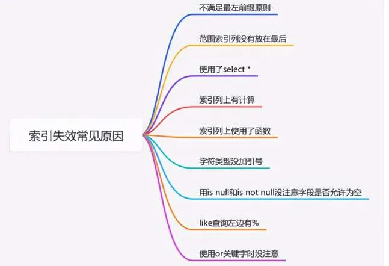

MySQL explain命令是查看MySQL查询优化器如何执行查询的主要方法，可以很好的分析SQL语句的执行情况。
每当遇到执行慢（在业务角度）的SQL，都可以使用explain检查SQL的执行情况，并根据explain的结果相应的去调优SQL等。

### 一、准备表
``````
# 建表
CREATE TABLE single_table (
    id INT NOT NULL AUTO_INCREMENT,
    key1 VARCHAR(100),
    key2 INT,
    key3 VARCHAR(100),
    key_part1 VARCHAR(100),
    key_part2 VARCHAR(100),
    key_part3 VARCHAR(100),
    common_field VARCHAR(100),
    PRIMARY KEY (id),
    KEY idx_key1 (key1),
    UNIQUE KEY idx_key2 (key2),
    KEY idx_key3 (key3),
    KEY idx_key_part(key_part1, key_part2, key_part3)
) Engine=InnoDB CHARSET=utf8;

CREATE TABLE tmp (
    id INT NOT NULL AUTO_INCREMENT,
    key1 VARCHAR(100),
    key2 INT,
    key3 VARCHAR(100),
    key_part1 VARCHAR(100),
    key_part2 VARCHAR(100),
    key_part3 VARCHAR(100),
    common_field VARCHAR(100),
    PRIMARY KEY (id),
    KEY idx_key1 (key1),
    UNIQUE KEY idx_key2 (key2),
    KEY idx_key3 (key3),
    KEY idx_key_part(key_part1, key_part2, key_part3)
) Engine=InnoDB CHARSET=utf8;

# 生成一些数据
# 定义存储过程
DROP PROCEDURE IF EXISTS proc_initData; 
DELIMITER $
CREATE PROCEDURE proc_initData()
BEGIN
    DECLARE i INT DEFAULT 1;
    WHILE i<=10000 DO
        insert into single_table(key1,key2,key3,key_part1,key_part2,key_part3,common_field) VALUES(substring(md5(rand()),1,15),floor(10000000 * rand()),substring(md5(rand()),1,15),substring(md5(rand()),1,15),substring(md5(rand()),1,15),substring(md5(rand()),1,15),substring(md5(rand()),1,15));
        SET i = i+1;
    END WHILE;
END $
delimiter ;

# 上面定义存储过程后,可能会有key冲突,可以多执行几次，生成较多测试数据
CALL proc_initData();
``````

### 二、测试
``````
mysql> EXPLAIN SELECT * FROM single_table\G;
*************************** 1. row ***************************
           id: 1
  select_type: SIMPLE
        table: single_table
   partitions: NULL
         type: ALL
possible_keys: NULL
          key: NULL
      key_len: NULL
          ref: NULL
         rows: 6896
     filtered: 100.00
        Extra: NULL
``````
对结果分析:
| 列名           | 说明                                           |
| -------------- | ---------------------------------------------- |
| id             | 标识select所属的行。如果有子查询，会顺序编号 |
| select_type    | 显示本行是简单或复杂select                   |
| table          | 表名                    |
| type           | 针对单表的访问方法                        |
| possible_keys  |可能用到的索引               |
| key            | 实际用的索引           |
| key_len        | 实际使用索引里占用的字节数                |
| ref            | 当使用索引列为等值查询时,对应的匹配信息      |
| rows           | 预估需要读取的行数，估算值不精确                |
| Extra          | 额外信息                                       |

### 2.1 id
给SELECT语句分配的id，因为我们的SQL语句可能包括多个查询，比如有子查询，连表查询，像这样
```
mysql> EXPLAIN SELECT * FROM single_table WHERE key1 in (SELECT key1 FROM single_table where key2 > 'a')\G;
*************************** 1. row ***************************
           id: 1
  select_type: SIMPLE
        table: single_table
   partitions: NULL
         type: ALL
possible_keys: idx_key1
          key: NULL
      key_len: NULL
          ref: NULL
         rows: 6896
     filtered: 100.00
        Extra: Using where
*************************** 2. row ***************************
           id: 1
  select_type: SIMPLE
        table: <subquery2>
   partitions: NULL
         type: eq_ref
possible_keys: <auto_distinct_key>
          key: <auto_distinct_key>
      key_len: 303
          ref: sql_test.single_table.key1
         rows: 1
     filtered: 100.00
        Extra: NULL
*************************** 3. row ***************************
           id: 2
  select_type: MATERIALIZED
        table: single_table
   partitions: NULL
         type: ALL
possible_keys: idx_key2,idx_key1
          key: NULL
      key_len: NULL
          ref: NULL
         rows: 6896
     filtered: 100.00
        Extra: Using where
3 rows in set, 2 warnings (0.41 sec)
```
为啥有三行？第一行和第二行都是1，第三行是2，这是为啥呢？跟接下来的select_type有点关系。
### 2.2 select_type
上面2.1的示例输出了三行，每行代表一个查询语句，select_type就是每行查询语句的类型，select_type的可选项比较多：
#### 2.2.1、SIMPLE
查询语句中不包含UNION或者子查询的查询都算作是SIMPLE类型；连接查询也是这个类型
#### 2.2.2、MATERIALIZED
上面示例的第三行就是这个类型，表明查询优化器把子查询物化成表了，第二行的table是<subquery2>就是这个物化表，前两行的id都是1，说明他们是连接查询，属于一个查询语句。
#### 2.2.3、PRIMARY
对于包含UNION、UNION ALL或者子查询的大查询来说，它是由几个小查询组成的，其中最左边的那个查询的select_type值就是PRIMARY
```
EXPLAIN SELECT * FROM single_table UNION SELECT * FROM tmp;
```
#### 2.2.4、UNION
对于包含UNION或者UNION ALL的大查询来说，它是由几个小查询组成的，其中除了最左边的那个小查询以外，其余的小查询的select_type值就是UNION
#### 2.2.5、UINON RESULT
MySQL选择使用临时表来完成UNION查询的去重工作，针对该临时表的查询的select_type就是UNION RESULT
#### 2.2.6、此外还有很多选项，有兴趣可以单独去了解。

### 3.3 partitions
忽略

### 2.4、type
查询一个数据，我们可以全表捞出来，然后再一条条对比找到这条数据，也可以通过索引马上得到它，这就是访问方式的不同，type就是表明使用了哪种访问方式，它也有很多选项，我们选其中一些来说：

#### 2.4.1、const
当查询条件为主键或唯一键的等值匹配，就是这种类型，这种类型查询贼快。
```
EXPLAIN SELECT * FROM single_table where id=1;
```
#### 2.4.2、eq_ref
在连接查询时，如果被驱动表是通过主键或者唯一二级索引列等值匹配的方式进行访问的，被驱动表的查询方式就是这个

EXPLAIN SELECT * FROM single_table INNER JOIN tmp ON single_table.id = tmp.id;
#### 2.4.3、ref
当通过普通的二级索引列与常量进行等值匹配时来查询某个表，那么对该表的访问方法就可能是ref
```
EXPLAIN SELECT * FROM single_table WHERE key1 = 'a';
```
#### 2.4.4、index_merge
有些情况下会使用索引合并的查询，即使用多个索引进行查询，然后将结果合并
```
EXPLAIN SELECT * FROM single_table WHERE key1 = 'a' OR key3 = 'a';
```
#### 2.4.5、range
使用索引字段的范围查询
```
EXPLAIN SELECT * FROM single_table WHERE key1 IN ('a', 'b', 'c');
```
#### 2.4.6、index
有联合索引时，但是我们查询条件只包含联合索引的右边某个字段，造成没法走这个联合索引，需要全表扫描，index表明走该联合索引全表扫描而不是走聚簇索引全表扫描，为啥呢？
因为聚簇索引包含完整数据，二级索引只包含索引字段和主键列，更加轻量，全表扫描二级索引的成本更低。
```
EXPLAIN SELECT key_part2 FROM single_table WHERE key_part3 = 'a';
```

#### 2.4.7、All
也就是全表扫描，危险信号！！！

### 2.5、possible_keys和key
possible_keys表示可能用到的索引，key表示实际使用索引。
```
EXPLAIN SELECT * FROM single_table WHERE key1 > 'z' AND key3 = 'a';
```
key1和key3都有索引，实际使用了key3的索引。MySQL会记录一些统计信息，查询优化器会判断使用哪个索引的成本更低就使用哪个索引。

### 2.6、key_len
实际使用索引的最大长度，单位字节。比如上面示例显示key_len是303个字节。咋算出来的呢？该字段是varchar(100)，然后是utf8，utf8字符集是三个字节，
则是100*3=300，然后该字段可以为NULL，则需要一个字节作为标志位，并且因为是varchar类型，所以需要2个字节记录它的实际长度，所以是300+1+2=303.

### 2.7、ref
ref表明在通过索引进行等值比较时，跟索引比较的值的类型是什么。
```
EXPLAIN SELECT * FROM single_table WHERE key1 = 'a';
```
这里的key1=‘a’,'a’就是个常量，所以是const。还有其他类型就自行了解吧。

### 2.8、rows
如果是走索引，表示本次查询的扫描索引记录数；如果是全表扫描，表示全表记录数。看执行计划时，这个字段也是需要重点关注的。

### 2.9、Extra
额外的说明信息，种类比较多，只说几个吧，全面的文档在这：https://dev.mysql.com/doc/refman/8.0/en/explain-output.html

#### 2.9.1、Using index
当我们的查询列和索引条件是同一个列，就是这个情况。啥意思呢？我们知道二级索引值存储了二级索引列和主键值，当查询列只包括二级索引列（或也有主键），则不需要回表查询聚簇索引了。
这也告诉我们，查询列尽量指明我们想要的列，如果查询条件是二级索引，查询列也是只有二级索引列（或也有主键），就能提升一定性能。
```
EXPLAIN SELECT key1 FROM single_table WHERE key1 = "2";
```
#### 2.9.2、Using where
参考：https://segmentfault.com/q/1010000003094577

1、查询条件没有索引或索引字段被函数修饰造成索引失效，走全表扫描了；
2、有时会出现"Using where; Using index"或"Using index condition; Using where"的情况，意思就是通过索引查出了数据，然后再通过where条件过滤掉不符合条件的记录。
3、这个提示跟走没走索引没有关系，可以不用太纠结。知道它是用来过滤返回个客户端的数据的就行。

#### 2.9.3、Using index condition
跟"Using index"一样，走索引了，但是涉及到的字段有些不在二级索引里，需要走一遍聚簇索引才能查到。
#### 2.9.4、Impossible WHERE
where条件始终是false，不会命中任何记录，比如你的条件是“where 1 != 1"

#### 2.9.5、Impossible WHERE noticed after reading const tables
1、用主键或唯一键查询时，查询一条不存在的记录。
2、关于"const"的解释：https://dev.mysql.com/doc/refman/8.0/en/explain-output.html#jointype_const

### 三、索引失效的一些场景
1、通过二级索引查找时，还是查出了太多数据，这个时候如果需要回表去查聚簇索引就会有随机IO，造成性能低下，这样MySQL可能会直接走聚簇索引的全表扫描。比如我们对createTime建了索引，如果你给了一个非常宽泛的时间，比如你要查好几年的数据，这样带出来的数据集就会比较大。
2、对索引字段用MySQL函数做了处理，比如我们对createTime建了索引，但是用的时候用date_format()包装了一下，也会使索引失效。
或者下列的情形：
```
SELECT * FROM single_table WHERE binary key1 = 'c90ab6cb630a35f';
```
索引列上有计算和函数，索引都会失效。
3、模糊搜索时，使用了like “%xxx”的形式，因为MySQL的索引是左匹配的。
4、在使用联合索引时，必须带上最左边的字段（也是左匹配原则），比如a,b,c字段建立联合索引，则(a=x and b=x)和（a=x and c=x)都是走索引的，但是(b=x) (b=x and c=x)是不走索引的。
5、虽然是索引字段，但是使用了"not in"
```
EXPLAIN SELECT * FROM single_table WHERE key1 not in ("22");
```
6、使用"or"联系一个索引字段和一个非索引字段
```
EXPLAIN SELECT key1 FROM single_table WHERE key1 = 'a' or common_field = 'a';
```
索引失效的场景比较多，这里只归纳了部分: 

